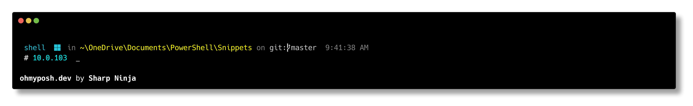

# PowerShell Snippets System

A cross-platform collection of PowerShell profile tools that provides a unified package manager abstraction, declarative module auto-loading, Bing search, Oh-My-Posh integration, and developer utilities.

[Tutorial on Medium](https://thesharp.ninja/powershell-snippets-tutorial-de75728ba5b0) ·
[GitHub Repository](https://github.com/PS-Services/Snippets)

---

## Getting Started

### Prerequisites

- **PowerShell 7.x** (recommended) or Windows PowerShell 5.1
- **Git** for cloning and updating Snippets

### Installation

#### Windows

1. Clone the repository:

   ```powershell
   git clone https://github.com/PS-Services/Snippets.git "$env:OneDrive\Documents\PowerShell\Snippets"
   ```

2. Edit `$PROFILE.AllUsersAllHosts` in an elevated editor and add:

   ```powershell
   $env:Snippets = "$env:OneDrive\Documents\PowerShell\Snippets"
   ```

3. Edit your `$PROFILE` to load snippets on startup (see [Example Profiles](#example-profiles) below).

#### Linux / WSL / macOS

1. Clone the repository:

   ```bash
   git clone https://github.com/PS-Services/Snippets.git ~/.config/powershell/Snippets
   ```

2. Edit `$PROFILE.AllUsersAllHosts` and add:

   ```powershell
   $env:Snippets = "$env:HOME/.config/powershell/Snippets"
   ```

3. **Or** use the automated installer:

   ```bash
   curl 'https://raw.githubusercontent.com/PS-Services/Snippets/master/linux-setup.sh' -v | /bin/bash
   ```

---

## Supported Platforms

| Platform | Shell | Repository Managers |
|----------|-------|---------------------|
| Windows | PowerShell 5.1, 7.x | winget, scoop, chocolatey, NuGet, dotnet, NPM, pip, PSGallery |
| Linux | PowerShell 7.x | apt, zypper, snap, homebrew, NuGet, dotnet, NPM, pip, PSGallery |
| macOS | PowerShell 7.x | homebrew, NuGet, dotnet, NPM, pip, PSGallery |

---

## Scripts Reference

### Utility Scripts

| Script | Alias | Platforms | Description |
|--------|-------|-----------|-------------|
| `bing.ps1` | `bing` | Windows, Linux, macOS | Search Bing from the command line. Requires `$env:BingApiKey` to be set. Usage: `bing search terms` |
| `clean-folder.ps1` | `clean` | Windows, Linux, macOS | Remove build artifacts (`bin`/`obj` folders). Usage: `clean -R -F` for recursive forced removal. |
| `github.ps1` | `hub` | Windows, Linux, macOS | Navigate to your GitHub repositories folder. Auto-detects by searching `$env:USERPROFILE` (Windows) or `$env:HOME` (Linux/macOS). Override with `$env:GITHUB`. Usage: `hub` or `hub <repo-name>` |
| `devmode.ps1` | `devmode` | Windows | Load Visual Studio 2022 Developer PowerShell tools. Installs `vswhere` via winget if needed. |
| `chocolatey.ps1` | — | Windows | Import the Chocolatey profile module and refresh environment variables. |
| `gh_completion.ps1` | — | Windows, Linux, macOS | Import GitHub CLI tab completions for PowerShell. |

### Oh-My-Posh Scripts

| Script | Alias | Platform | Description |
|--------|-------|----------|-------------|
| `oh-my-posh-windows.ps1` | `posh` | Windows | Installs Oh-My-Posh via scoop if missing, initializes with `ninja.omp.json` theme. |
| `oh-my-posh-linux.ps1` | `posh` | Linux / WSL | Downloads Oh-My-Posh binary to `/usr/local/bin`, initializes with `ninja.omp.json` theme. |
| `oh-my-posh-macos.ps1` | `posh` | macOS | Installs Oh-My-Posh via Homebrew if missing, initializes with `ninja.omp.json` theme. |

### Oh-My-Posh Integration

[Oh-My-Posh](https://ohmyposh.dev/) is a prompt theme engine that renders a richly formatted command-line prompt with information like the current directory, git status, language versions, execution time, and exit codes. Snippets automatically installs, configures, and initializes Oh-My-Posh on every platform.

#### How It Works

During profile startup, the appropriate `oh-my-posh-*.ps1` script runs for the detected OS:

1. **Checks** if the `oh-my-posh` binary is available on the system.
2. **Installs** it automatically if missing:
   - **Windows**: Installs via `scoop` using the official manifest from GitHub releases.
   - **Linux / WSL**: Downloads the `posh-linux-amd64` binary to `/usr/local/bin/` with `sudo`.
   - **macOS**: Installs via `brew install oh-my-posh`.
3. **Initializes** Oh-My-Posh for the current shell using the `ninja.omp.json` theme from the Snippets directory.
4. **Registers** the `posh` alias, which can be used to run Oh-My-Posh commands directly:

   ```powershell
   posh get shell       # Show current shell info
   posh config export   # Export current configuration
   ```

#### The `.omp.json` Theme File

Oh-My-Posh themes are JSON files with the `.omp.json` extension. They define the layout, colors, and content segments of your prompt. This repo ships with `ninja.omp.json`, a multi-line prompt theme.

##### Theme Schema

Every `.omp.json` file follows the [Oh-My-Posh schema](https://raw.githubusercontent.com/JanDeDobbeleer/oh-my-posh/main/themes/schema.json) and has this top-level structure:

```json
{
  "$schema": "https://raw.githubusercontent.com/JanDeDobbeleer/oh-my-posh/main/themes/schema.json",
  "version": 3,
  "final_space": true,
  "blocks": [ ... ]
}
```

| Field | Description |
|-------|-------------|
| `$schema` | Points to the official JSON schema for editor autocompletion and validation. |
| `version` | Theme format version. Current version is `3`. |
| `final_space` | When `true`, adds a trailing space after the prompt character. |
| `blocks` | Array of prompt blocks. Each block contains segments that render prompt information. |

##### Blocks

A block defines a horizontal section of the prompt. Blocks render in order, top to bottom. Key block properties:

```json
{
  "type": "prompt",
  "alignment": "left",
  "newline": true,
  "segments": [ ... ]
}
```

| Property | Values | Description |
|----------|--------|-------------|
| `type` | `prompt`, `rprompt` | `prompt` renders left-aligned; `rprompt` renders right-aligned. |
| `alignment` | `left`, `right` | Text alignment within the block. |
| `newline` | `true` / `false` | Start this block on a new line. |
| `segments` | Array | The segments to render in this block. |

##### Segments

Segments are the building blocks of the prompt. Each segment renders a specific piece of information. Available segment types include `path`, `git`, `node`, `dotnet`, `python`, `time`, `exit`, `shell`, `os`, `root`, `text`, `executiontime`, and [many more](https://ohmyposh.dev/docs/segments).

```json
{
  "type": "git",
  "style": "plain",
  "template": "<darkGray>on</> <white>git:</>{{ .HEAD }} ",
  "foreground": "#ffffff"
}
```

| Property | Description |
|----------|-------------|
| `type` | The segment type (e.g., `git`, `path`, `node`, `dotnet`, `time`). Determines what data is available in the template. |
| `style` | Rendering style: `plain` (text only), `powerline` (colored backgrounds with arrow separators), or `diamond` (custom start/end characters). |
| `template` | [Go template](https://ohmyposh.dev/docs/configuration/templates) defining the output. Uses `{{ .Property }}` syntax with access to segment-specific data. Supports `<color>text</>` for inline colors. |
| `foreground` | Text color. Can be a named color (`white`, `red`, `lightYellow`) or hex (`#26C6DA`). |
| `background` | Background color (used with `powerline` and `diamond` styles). |
| `background_templates` | Conditional backgrounds using Go templates (e.g., red background on error). |
| `properties` | Segment-specific settings (e.g., `style: "full"` for path, `time_format` for time). |

##### The `ninja.omp.json` Theme

The included `ninja.omp.json` theme is a three-line prompt designed for developer workflows. Here's how it looks in a terminal:



The prompt shows the shell type, OS icon, full directory path, git branch, current time, .NET SDK version (when in a .NET project), and a `$` input character. Segments appear conditionally — for example, the Node.js version only shows when a `package.json` exists in the current directory.

###### Line-by-line breakdown

**Line 1** — Python environment (shown only when a Python virtualenv is active):

```
(venv 3.11.5)
```

**Line 2** — Main info line:

```
⚡ Core  in ~/Projects/MyApp on git:main 3:04:05 PM C:1
```

| Segment | Type | What it shows |
|---------|------|---------------|
| ⚡ | `root` | Lightning bolt when running as admin/root. |
| Core / Desktop | `shell` | Maps `pwsh` → "Core", `powershell` → "Desktop". |
| 🪟 / 🐧 / 🍎 | `os` | OS icon. Shows "WSL at" prefix when in WSL. |
| `~/Projects/MyApp` | `path` | Full current directory path. |
| `git:main` | `git` | Current branch and HEAD reference. |
| `3:04:05 PM` | `time` | Current time in 12-hour format. |
| `C:1` | `exit` | Last command exit code (only shown when non-zero). |

**Line 3** — Language context and input:

```
 🟢 node 18.17.0  # .NET 8.0.100  ⏱ 1.2s  ‼ 1: GenericError $
```

| Segment | Type | What it shows |
|---------|------|---------------|
| Node version | `node` | Node.js version and package manager icon (shown when `package.json` exists). |
| .NET version | `dotnet` | .NET SDK version (shown when `.csproj`/`.sln` exists). ⚠️ if unsupported. |
| Execution time | `executiontime` | Duration of last command (shown when >500ms). |
| Exit details | `exit` | Exit code and meaning with red background (shown on error). |
| `$` | `text` | The prompt character. |

###### Full `ninja.omp.json` Source

<details>
<summary>Click to expand the complete theme file</summary>

```json
{
  "$schema": "https://raw.githubusercontent.com/JanDeDobbeleer/oh-my-posh/main/themes/schema.json",
  "blocks": [
    {
      "type": "prompt",
      "alignment": "left",
      "segments": [
        {
          "type": "python",
          "style": "plain",
          "foreground": "white",
          "template": "({{ if .Error }}{{ .Error }}{{ else }}{{ if .Venv }}{{ .Venv }} {{ end }}{{ .Full }}{{ end }})",
          "properties": {
            "fetch_version": false
          }
        }
      ]
    },
    {
      "type": "prompt",
      "alignment": "left",
      "newline": true,
      "segments": [
        {
          "type": "root",
          "style": "powerline",
          "powerline_symbol": "\ue0b0",
          "foreground": "#111111",
          "background": "#ffff66",
          "template": "\uf0e7"
        },
        {
          "type": "shell",
          "style": "plain",
          "foreground": "#26C6DA",
          "template": "\u2800{{ .Name }}\u2800",
          "properties": {
            "mapped_shell_names": {
              "powershell": "Desktop",
              "pwsh": "Core"
            }
          }
        },
        {
          "type": "os",
          "style": "plain",
          "foreground": "#26C6DA",
          "template": "\u2800{{ if .WSL }}WSL at {{ end }}{{.Icon}}\u2800"
        },
        {
          "type": "path",
          "style": "plain",
          "foreground": "lightYellow",
          "template": "<darkGray>in </>{{ .Path }} ",
          "properties": {
            "style": "full"
          }
        },
        {
          "type": "git",
          "style": "plain",
          "template": "<darkGray>on</> <white>git:</>{{ .HEAD }} "
        },
        {
          "type": "time",
          "style": "plain",
          "foreground": "darkGray",
          "properties": {
            "time_format": "3:04:05 PM"
          }
        },
        {
          "type": "exit",
          "style": "plain",
          "foreground": "red",
          "template": " C:{{ if gt .Code 0 }}{{ .Code }}{{ end }} "
        }
      ]
    },
    {
      "type": "prompt",
      "alignment": "left",
      "newline": true,
      "segments": [
        {
          "type": "node",
          "style": "plain",
          "foreground": "#ffffff",
          "background": "#6CA35E",
          "template": " \ue718 {{ if .PackageManagerIcon }}{{ .PackageManagerIcon }} {{ end }}{{ .Full }} ",
          "properties": {
            "display_mode": "files",
            "fetch_package_manager": true
          }
        },
        {
          "type": "dotnet",
          "style": "plain",
          "foreground": "#00ffff",
          "template": " <white><b>#</b></> {{ if .Unsupported }}\uf071{{ else }}{{ .Full }}{{ end }} ",
          "properties": {
            "display_mode": "files"
          }
        },
        {
          "type": "executiontime",
          "style": "plain",
          "foreground": "#ffffff",
          "template": " <#fefefe>\u231a</> {{ .FormattedMs }} ",
          "properties": {
            "style": "austin",
            "threshold": 500
          }
        },
        {
          "type": "exit",
          "style": "plain",
          "foreground": "#ffffff",
          "template": " \u203c {{.Code}}<yellow>:</> {{ .Meaning }} \u203c ",
          "background_templates": [
            "{{ if gt .Code 0 }}#9c1442{{ end }}"
          ],
          "properties": {
            "always_enabled": false
          }
        },
        {
          "type": "text",
          "style": "plain",
          "foreground": "#ff2100",
          "properties": {
            "text": "$"
          }
        }
      ]
    }
  ],
  "version": 3,
  "final_space": true
}
```

</details>

#### Customizing the Theme

To customize the prompt:

1. **Edit directly**: Modify `ninja.omp.json` in the Snippets directory. Changes take effect on the next shell launch.

2. **Use a different theme**: Oh-My-Posh ships with [many built-in themes](https://ohmyposh.dev/docs/themes). To preview them:

   ```powershell
   # List available themes
   Get-PoshThemes

   # Or preview in the terminal
   oh-my-posh init pwsh --config "$env:POSH_THEMES_PATH/jandedobbeleer.omp.json" | Invoke-Expression
   ```

3. **Use a custom theme file**: Place your `.omp.json` file anywhere and update the path in the oh-my-posh script, or set the `$POSH_THEMES_PATH` environment variable.

4. **Live editing**: Use the Oh-My-Posh [configuration tool](https://ohmyposh.dev/docs/configuration/overview) or any JSON editor with schema support for IntelliSense.

##### Adding a Segment

To add a new segment (e.g., Kubernetes context), add it to the `segments` array of the desired block:

```json
{
  "type": "kubectl",
  "style": "plain",
  "template": " ⎈ {{ .Context }}{{ if .Namespace }}:{{ .Namespace }}{{ end }} ",
  "foreground": "#6495ED"
}
```

##### Changing Colors

Colors can be set using names (`white`, `red`, `lightYellow`, `darkGray`) or hex codes (`#26C6DA`). Use `<color>text</>` for inline coloring within templates:

```json
"template": "<darkGray>in </><lightYellow>{{ .Path }}</>"
```

#### Nerd Fonts

Oh-My-Posh uses special glyphs (icons) that require a [Nerd Font](https://www.nerdfonts.com/). If you see squares or missing characters in your prompt:

1. Install a Nerd Font (e.g., `CaskaydiaCove Nerd Font`, `FiraCode Nerd Font`, `MesloLGM Nerd Font`):

   ```powershell
   # Windows (via scoop)
   scoop bucket add nerd-fonts
   scoop install CascadiaCode-NF

   # Or via Oh-My-Posh
   oh-my-posh font install CascadiaCode
   ```

2. Configure your terminal emulator to use the Nerd Font:
   - **Windows Terminal**: Settings → Profile → Appearance → Font face
   - **VS Code**: `"terminal.integrated.fontFamily": "CaskaydiaCove Nerd Font"`
   - **iTerm2**: Preferences → Profiles → Text → Font

### System Scripts

| Script | Alias | Platforms | Description |
|--------|-------|-----------|-------------|
| `_common.ps1` | `snipps` | All | Bootstrap script. Initializes the Snippets environment, sets version info, detects OS. Use `snipps` to navigate to the Snippets folder. |
| `_repos.ps1` | _(see Repositories)_ | All | Loads `SnippetsManager.psm1` and registers all package manager aliases. |
| `module-loader.ps1` | `modrl` | All | Auto-loads modules from `modules.yml`. Use `modrl` to reload all or `modrl <name>` for a single module. |
| `update-snippets.ps1` | `snipup` / `profileup` | All | `snipup` pulls the latest Snippets from GitHub. `profileup` updates your `$PROFILE` with the latest template. |

---

## Unified Repository System

The repository system (`SnippetsManager.psm1`) provides a single interface to query and manage packages across 14 package managers. Each manager is accessed via a short alias.

### How It Works

Every alias maps to the `Invoke-Any` function which resolves the alias name to select the appropriate package manager. Commands follow a consistent pattern:

```
<alias> <command> <package> [options]
```

### Common Commands

| Command | Description |
|---------|-------------|
| `search <package>` | Search for a package across the repository. |
| `install <package>` | Install a package. |
| `uninstall <package>` | Remove a package. |
| `update <package>` | Update a specific package. |
| `list` | List installed packages. |
| `show <package>` | Show detailed package information. |
| `outdated` | List packages with available updates. |

### Common Aliases (All Platforms)

| Alias | Manager | Notes |
|-------|---------|-------|
| `dn` | dotnet | Wraps `dotnet add package` / `dotnet list package` |
| `dt` | dotnet tool | Wraps `dotnet tool install` / `dotnet tool list` |
| `ng` | NuGet | Wraps `nuget.exe` commands |
| `np` | NPM | Wraps `npm install` / `npm search` |
| `pp` | pip | Wraps `pip install` / `pip list` |
| `pps` | pip-search | Uses `pip_search` for PyPI search (since `pip search` is disabled) |
| `psg` | PSGallery | Manages PowerShell modules via `PSResourceGet` or `PowerShellGet` |

### Windows Aliases

| Alias | Manager | Uses `sudo` | Notes |
|-------|---------|:-----------:|-------|
| `wg` | winget | No | Defaults to `winget` store. Add `-Store` parameter to change. |
| `scp` | scoop | No | Defaults to `main` bucket. Add `-Store` parameter to change. |
| `ch` | chocolatey | Yes | Always adds `-y` parameter for unattended installs. |

### Linux / macOS Aliases

| Alias | Manager | Uses `sudo` | Notes |
|-------|---------|:-----------:|-------|
| `ap` | apt | Yes | Adds `-y` parameter as appropriate. |
| `zy` | zypper | Yes | For openSUSE and SLES systems. |
| `sn` | snap | Yes | Snap package manager. |
| `br` | homebrew | No | Available on Linux and macOS. |

### Multi-Repository Search

Use `repos` to search all available package managers at once:

```
repos search oh-my-posh
```

```
Repo       Command
----       -------
PSGallery  Install-Module oh-my-posh -Scope CurrentUser
scoop      install oh-my-posh@18.5.0
sudo choco install oh-my-posh --version 18.5.0 -y
winget     install XP8K0HKJFRXGCK -s msstore # oh-my-posh
dotnet     No results found.
nuget      No results found.
npm        No results found.
pip        No results found.
```

### PSGallery Examples

```powershell
psg search posh-git          # Search PSGallery for posh-git
psg install posh-git         # Install posh-git to CurrentUser scope
psg show posh-git            # Show module details
psg list                     # List installed PS modules
psg uninstall posh-git       # Remove posh-git
```

---

## Module Auto-Loader

Declare your PowerShell modules in a YAML file and they will be automatically installed and imported during profile startup.

### Configuration

The auto-loader reads module definitions from a `modules.yml` file:

1. **Default path**: `$env:Snippets\modules.yml` (ships with the repo, contains only `powershell-yaml`)
2. **User override**: Set `$env:SnippetsModulesYaml` in your `$PROFILE` to point to your own file

```powershell
# In $PROFILE, before the Snippets loading block:
$env:SnippetsModulesYaml = "$env:USERPROFILE\modules.yml"    # Windows
$env:SnippetsModulesYaml = "$env:HOME/modules.yml"           # Linux/macOS
```

### YAML Schema

```yaml
modules:
  - name: ModuleName          # Required. The PowerShell module name.
    version: "1.0.0"          # Optional. Minimum required version.
    source: PSGallery          # Optional. "PSGallery" (default) or file path to .psd1/.psm1.
    required: true             # Optional. Default: true. If false, failure is non-fatal.
    parameters: []             # Optional. Arguments passed to Import-Module -ArgumentList.
```

### Behavior

| Feature | Details |
|---------|---------|
| **PSGallery modules** | Installed automatically to `CurrentUser` scope if missing or below the specified version. |
| **Path-based modules** | Imported directly from the specified `.psd1` or `.psm1` file path. Useful for local development modules. |
| **Required modules** | Raise an error visible in the console if they fail to load. |
| **Optional modules** | Fail silently (verbose message only). |
| **YAML parser** | `powershell-yaml` is bootstrapped first; if unavailable (e.g., no network), the loader degrades gracefully. |
| **Version parsing** | Supports standard version strings. SemVer pre-release suffixes (e.g., `-beta`) are stripped before comparison. |
| **Reload** | Use `modrl` to reload all modules from YAML, or `modrl <name>` to reload a single module by name. |

### Example `modules.yml`

```yaml
modules:
  - name: powershell-yaml
    required: true

  - name: posh-git
    required: false

  - name: Terminal-Icons
    required: false
    version: "0.11.0"

  - name: WingetTools
    version: "1.7.0"

  - name: MsixTools
    source: "E:\\github\\remote-agent\\scripts\\MsixTools\\MsixTools.psd1"
    required: false
```

---

## Environment Variables

| Variable | Required | Description |
|----------|:--------:|-------------|
| `$env:Snippets` | **Yes** | Path to the Snippets repository. Set in `$PROFILE.AllUsersAllHosts`. |
| `$env:SnippetsModulesYaml` | No | Path to user-specific `modules.yml`. Defaults to `$env:Snippets\modules.yml`. |
| `$env:GITHUB` | No | Root folder of your GitHub repositories. Auto-detected from `$env:USERPROFILE` or `$env:HOME` if not set. |
| `$env:BingApiKey` | No | Bing Search API subscription key. Required for the `bing` alias to function. |
| `$env:VerboseStartup` | No | Set to `'true'` for verbose output during profile initialization. |
| `$env:SnippetsVersion` | Auto | Set automatically during initialization. Contains the current Snippets version from `.version`. |
| `$env:SnippetsInitialized` | Auto | Set to `'true'` after initialization completes. Prevents re-initialization. |
| `$env:IsWindows` | Auto | Detected OS flag: `'True'` on Windows, `'False'` otherwise. |
| `$env:IsUnix` | Auto | Detected OS flag: `'True'` on Linux/macOS, `'False'` on Windows. |
| `$env:IsDesktop` | Auto | `'True'` when running Windows PowerShell (Desktop edition), `'False'` for Core. |

---

## Example Profiles

### Windows `$PROFILE`

```powershell
$env:Snippets = "$env:OneDrive\Documents\PowerShell\Snippets"
$env:SnippetsModulesYaml = "$env:USERPROFILE\modules.yml"

if ($env:VerboseStartup -eq 'true') {
    [switch]$Verbose = $true
} else {
    [switch]$Verbose = $false
}

Set-ExecutionPolicy -ExecutionPolicy Unrestricted -Scope Process

try {
    Import-Module Microsoft.PowerShell.Utility

    if (Test-Path $env:Snippets) {
        Push-Location
        Set-Location $env:Snippets
        $snippets = Get-ChildItem *.ps1
        Pop-Location

        $snippets.FullName | ForEach-Object -Process {
            . $_ -Verbose:$Verbose
        }
    }
    else {
        Write-Verbose "No directory found at [$env:Snippets]" -Verbose:$Verbose
    }

    Write-Verbose 'PowerShell Ready.' -Verbose:$Verbose
}
catch {
    Write-Host $Error
}
finally {
    Write-Verbose "Leaving $Profile" -Verbose:$Verbose
}
```

### Linux / WSL / macOS `$PROFILE`

```powershell
$profileScript = Split-Path $PROFILE -Leaf

if ((-not $env:Snippets) -or (-not (Test-Path $env:Snippets))) {
    $env:Snippets = "$env:HOME/.config/powershell"
}

$env:SnippetsModulesYaml = "$env:HOME/modules.yml"

if ($env:VerboseStartup -eq 'true') {
    [switch]$MasterVerbose = $true
} else {
    [switch]$MasterVerbose = $false
}

try {
    Push-Location -Verbose:$MasterVerbose
    Import-Module Microsoft.PowerShell.Utility

    $env:Snippets = Join-Path $env:Snippets -ChildPath Snippets

    if (-not (Test-Path $env:Snippets)) {
        git clone "https://github.com/PS-Services/Snippets.git"
    }

    if (Test-Path $env:Snippets) {
        Push-Location; Set-Location $env:Snippets
        $snippets = Get-ChildItem *.ps1 -Exclude _common.ps1
        Pop-Location

        $snippets.FullName | ForEach-Object {
            try {
                $result = . $_ -Verbose:$MasterVerbose
            } catch {
                Write-Error "[$profileScript] Error in $(Split-Path $_ -Leaf): $_"
            }
        }
    }
}
catch {
    Write-Error "[$profileScript] $_"
}
finally {
    Pop-Location
}

Get-Alias | Where-Object Description -imatch 'snippet' |
    Sort-Object Description, Name |
    Format-Table Name, Description -AutoSize
```

---

## Complete Alias Reference

| Alias | Category | Description |
|-------|----------|-------------|
| `bing` | Search | Search Bing from the command line |
| `clean` | Dev | Remove `bin`/`obj` folders |
| `hub` | Dev | Navigate to GitHub repos folder |
| `devmode` | Dev | Start VS 2022 Developer Mode |
| `posh` | Shell | Execute Oh-My-Posh commands |
| `snipps` | Snippets | Navigate to Snippets folder |
| `snipup` | Snippets | Update Snippets from GitHub |
| `profileup` | Snippets | Update `$PROFILE` from template |
| `modrl` | Modules | Reload one or all YAML-defined modules |
| `repos` | Repos | Search all OS package managers |
| `dn` | Repos | dotnet package commands |
| `dt` | Repos | dotnet tool commands |
| `ng` | Repos | NuGet commands |
| `np` | Repos | NPM commands |
| `pp` | Repos | pip commands |
| `pps` | Repos | pip-search commands |
| `psg` | Repos | PSGallery module commands |
| `wg` | Repos | winget commands (Windows) |
| `scp` | Repos | scoop commands (Windows) |
| `ch` | Repos | chocolatey commands (Windows) |
| `ap` | Repos | apt commands (Linux) |
| `zy` | Repos | zypper commands (Linux) |
| `sn` | Repos | snap commands (Linux) |
| `br` | Repos | homebrew commands (Linux/macOS) |

---

## Architecture

### How Snippets Loads

1. **`$PROFILE`** sets `$env:Snippets` and dot-sources all `.ps1` files in the Snippets folder.
2. **`_common.ps1`** runs first via each snippet's initialization guard. It sets environment flags, loads the version, and runs the module auto-loader.
3. **Each snippet** checks `$env:SnippetsInitialized` — if not set, it calls `Initialize-Snippets` to bootstrap.
4. **`_repos.ps1`** imports `SnippetsManager.psm1`, which defines all package manager classes and registers aliases.
5. **`module-loader.ps1`** is called by `Initialize-Snippets` to process `modules.yml`.

### SnippetsManager Class Hierarchy

```
PackageManager (base class)
├── Execute()          — Runs CLI tool with arguments
├── ParseResults()     — Parses stdout into ResultItem[]
└── ParseResultItem()  — Parses a single line

Subclasses:
├── WingetManager          (wg)
├── ScoopManager           (scp)
├── ChocolateyManager      (ch)
├── AptManager             (ap)
├── ZypperManager          (zy)
├── SnapManager            (sn)
├── BrewManager            (br)
├── NugetManager           (ng)
├── DotnetManager          (dn)
├── DotnetToolManager      (dt)
├── NPMManager             (np)
├── PIPManager             (pp)
├── PIPSearchManager       (pps)
└── PSGalleryManager       (psg) — Overrides Execute() to use PowerShell cmdlets
```

### File Structure

```
Snippets/
├── _common.ps1              # Bootstrap and initialization
├── _repos.ps1               # Package manager loader
├── SnippetsManager.psm1     # Core module: PackageManager classes
├── module-loader.ps1        # YAML module auto-loader
├── modules.yml              # Default module definitions
├── bing.ps1                 # Bing search snippet
├── bing.csx                 # C# script for Bing API
├── clean-folder.ps1         # Build artifact cleanup
├── chocolatey.ps1           # Chocolatey profile import
├── devmode.ps1              # VS 2022 dev tools
├── gh_completion.ps1        # GitHub CLI completions
├── github.ps1               # GitHub folder navigation
├── oh-my-posh-windows.ps1   # Oh-My-Posh (Windows)
├── oh-my-posh-linux.ps1     # Oh-My-Posh (Linux/WSL)
├── oh-my-posh-macos.ps1     # Oh-My-Posh (macOS)
├── update-snippets.ps1      # Self-update tooling
├── set-version.ps1          # GitVersion integration
├── ninja.omp.json           # Oh-My-Posh theme
├── GitVersion.yml           # GitVersion configuration
├── 3rdParty/                # Third-party scripts
│   └── parse-winget/        # Winget output parser
├── docs/                    # DocFX documentation site
└── .github/workflows/       # CI/CD workflows
```
